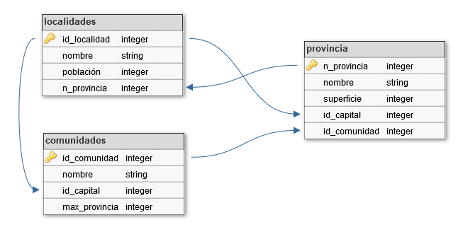

# Relación 03 de PHP

Relación de ejercicios del tema 6 del libro Implantación de aplicaciones web de la editorial Garceta. El material necesario lo podéis en el repositorio github del tema, además de las soluciones: [5-php-intercambio](https://github.com/jorgesancheznet/libro-iaw/tree/master/6-php-bd).

## Práctica 6.1: Búsqueda de datos de localidades

- Para realizar esta práctica debemos descargar y ejecutar (con permiso de root en MySQL) los archivos de esta prácticas presentes en la dirección [BD Geografía](https://github.com/jorgesancheznet/libro-iaw/tree/master/6-php-bd/geografia).

- Una vez hayamos ejecutado esas instrucciones, nuestra instalación de MySQL tendrá una nueva base de datos llamada ***geografía*** que contiene datos de la mayoría de localidades de España.

- La estrucutra relacional de esas tablas es la siguiente:

- La práctica consiste en encontrar una localidad eligiendo primero la comunidad en la que está, luego una provincia de esa localidad y finalmente elegir la localidad de una lista de las localidades de esa provincia.

- Para ello un primer formulario nos muesra la lista de comunidades.

- Tras elegir la comunidad, un segundo formulario nos muestra las provincias de esa comunidad.

- Tras elegir la comunidad, un segundo formulario nos muestra las provincias de esa comunidad.

- Finalmente un tercer formulario nos muestra una lista con las localidades de la provincia elegida.

- Cuando elijamos la localidad deseada, se nos enseña la población que tiene esa localidad. Eso se hará debajo de la lista de localidades, la misma página nos muestra ese resultado.

- Si acudimos a la provincia sin haber pasado vía GET una comunidad, se nos devolverá al formulario de las comunidades. Si vamos a las localidades sin haber pasado una provincia, se nos enviará al formulario de provincias.

## Práctica 6.2: Paginación de resultados

- Utiliza los datos de la base de datos geografía. Para obtenerlos e instalarlos véase el enunciado e inicio de la solución de la **Práctica 6.1**.

- Muestra una primera página que pida mediante un cuadro de texto el nombre de una provincia española.

- Al enviar ese dato se busca la provincia. De no existir se indica que no existe. Hay que tener en cuenta que, al buscar, no tendremos en cuenta si la provincia se ha escrito en minúscula o en mayúscula.

- Si la provincia si existe, se mostrarán los datos de todas sus localidades en orden alfabético y de forma paginada. Se mostrarán 25 localidades por página. Una serie de botones nos permitirán pasar a la página siguiente, a la anterior o a un número de página concreto.

## Práctica 6.3: Servicio de mensajería

- Crea un pequeño servicio de mensajería instantánea accesible desde una aplicación web. De modo que el funcionamineto sea el siguiente:
  
  - En la pgina de acceso los usuarios tienen que poder darse de alta (simplemente indicando su nombre de usuario y la contraseña) o simplemente decir que ya están dados de alta y entrar en su cuenta indicando el usuario y la contraseña.
  
  - Los nombres de usuario solo pueden contener letras y números (no vale espacio). La contraseña tiene que tener entre 6 y 30 caracteres.
  
  - Al entrar en su cuenta aparecen los mensajes que tienen y el nombre del usuario que les ha enviado el mensaje.
  
  - Desde cada cuenta se nos permite la posibilidad enviar un mensaje a otro usuario.
  
- Es imperativo controlar los errores para que el usuario sepa lo que ocurre en cada momento.
 
 ## Práctica 6.4: Mejora del servicio de mensajera
 
- Consigue que dentro del buzón de cada usuario, en cada mensaje dispongamos de un botn o un enlace que nos permita eliminar el mensaje.
 
- Implementa una mejora tanto en la base de datos como en la aplicación web que nos permita detectar qué mensajes son nuevos y, por ejemplo, colorearles distintos del resto.

## Práctica 6.5: Juego geogrfico

- Utilizando la base de datos geogrfica de la **práctica 6.1** y la **práctica 6.2**, haz un juego de conocimientos geográficos.

- En este juego debe aparecer una localidad aleatoria de la lista de localidades de esa base de datos.

- El usuario debe escribir en qué provincia está.

- En todo momento iremos diciendo al usuario cuántos aciertos lleva, cuántos errores lleva y cuál es el porcentaje de aciertos.

## Práctica 6.6: Ocupación de cursos

- Crea en MySQL una base de datos llamada **cursos** con una sola tabla llamada también **cursos**. En la tabla almacenamos:

  - El título del curso.
  - El número de plazas disponibles.
  - El número de plazas ocupadas.
  
 - Con esta tabla crear una aplicación que permita mostrar y añadir más ocupación a los cursos. La idea es que aparezca la lista mostrando el título de cada curso, las plazas ocupadas, las plazas libres y un enlace o botn que permita ocupar una plaza más en ese curso.
 
 - Los cursos que tienen ocupadas todas las plazas aparecerán en formato tachado.
 
 - Al final de la lista se muestra el total de plazas ofertadas, el total de disponibles y el pocertaje de ocupación.
 
 ## Práctica 6.7: Tienda online
 
 - Implementa una tienda online.
 
 - Con ella mostrarás una listade artículos con su descripcin, al menos una foto y el precio.
 
 - En cada artículo un enlace nos permitirá meterlo en el carrito de la compra.
 
 - En el carrtio podremos ver lo que hemos comprado, así como modificar la cantidad comprada de cada artículo o bien quitar el artículo del carrito. Incluso borrar el carrito.
 
 - El carrito debe mantener una semana los artículos por si el usuario cierra la sesión, que pueda seguir con el mismo carrito.
